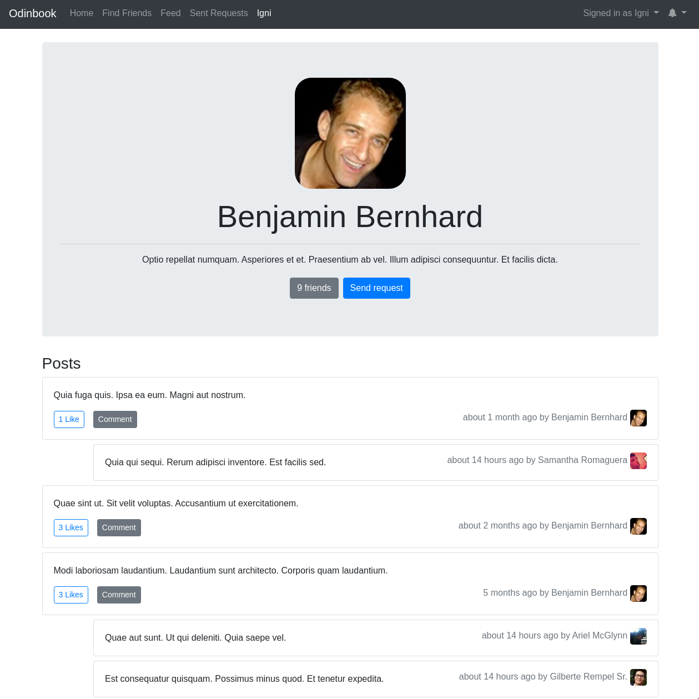
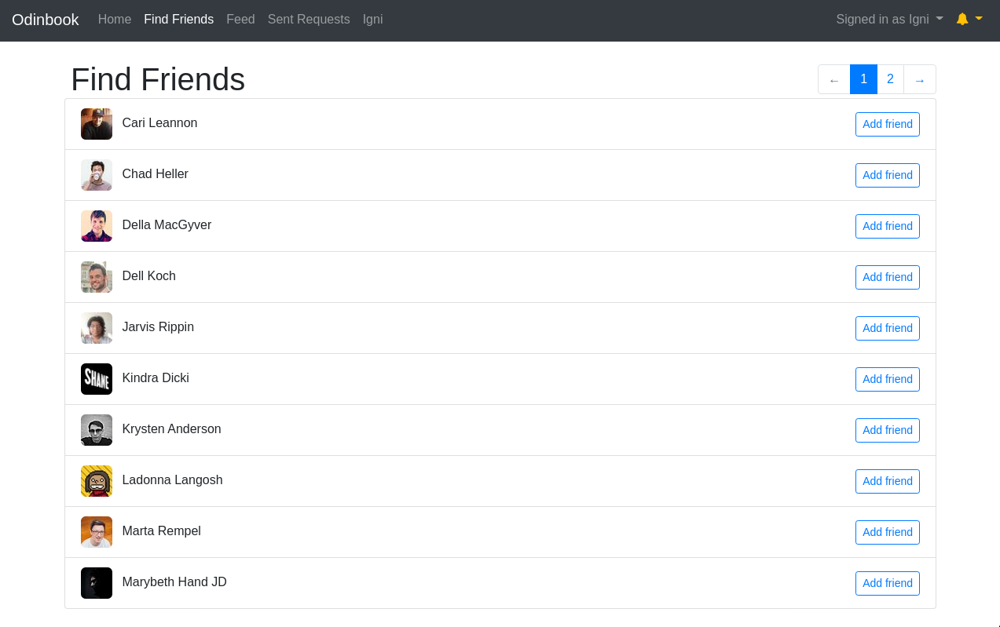
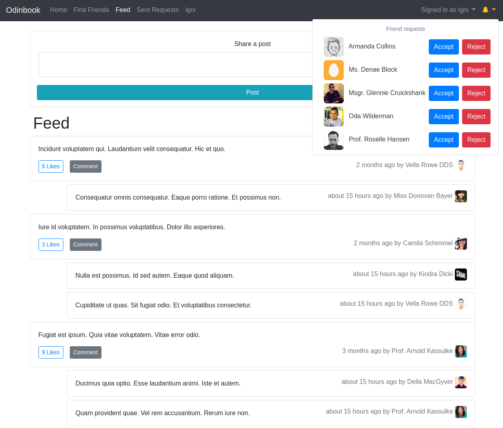

# Odinbook

This is the final project for
[The Odin Project Ruby on Rails](https://www.theodinproject.com/courses/ruby-on-rails) section.
This is a rails app with similar functionality to Facebook.
The full project requirements can be found
[here](https://www.theodinproject.com/lessons/final-project).

You can visit the deployed site at this link: https://intense-citadel-17328.herokuapp.com/

If you have any feedback, questions, or see any inappropriate content on the site,
please feel free to open an issue.

## Getting Started

### Prerequisites

You will need to install and setup the following to run this application locally
- Ruby 2.7.1
- [Bundler](https://bundler.io/)
- [Postgres](https://www.postgresql.org/)
- [Imagemagick](https://imagemagick.org/index.php)

### Installing
Clone this repository and change your current your current working directory with
```bash
  git clone git@github.com:rankoliang/odinbook.git && cd odinbook
```

Next, install the necessary ruby libraries by running
```bash
  bundle
```

You will also need to setup your environment variables.
It will need to look something like this:
```
HOSTNAME=[host-name]
DISCORD_CLIENT_ID=[client_id]
DISCORD_CLIENT_SECRET=[client_secret]
```
You can obtain the discord credentials through their development portal.
You will also need to permit redirect URIs in the developer portal for oauth to work.
To use it locally, permit this URI
```
http://localhost:3000/users/auth/discord/callback
```

To run the server locally, type this into your command prompt
```bash
rails server
```

To run the test suite, type this into your command prompt
```
rspec
```

This app was deployed through heroku.
If you wish to do the same, you will need to configure
[sendgrid](https://devcenter.heroku.com/articles/sendgrid) for emails and
[cloudinary](https://elements.heroku.com/addons/cloudinary) for image hosting.
The profile pictures are sourced from the https://uifaces.co/
via this [ruby gem](https://github.com/guinslym/Uifaces).

## Features
- Users can
  - post and comment on posts
  - send and receive friend requests
  - set their own profile picture
  - See friend's posts in their feed
  - like posts

## Screenshots




## Potential future improvements
- Mobile/responsive design
- ability for users to post images
- ability for users to comment on comments
- ability for users to like comments
- ability to search for users
- privacy permissions (ex: restrict friends to see and comment on posts)
- active admin dashboard to manage content and users on the site

## License
This project is licensed under the MIT License.
